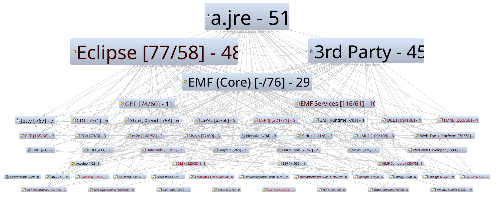

# Dependencies
 

# Projects

This report was generated 2026-09-04.

##  a.Participant ⭐ 8
-  [Eclipse JustJ](https://projects.eclipse.org/projects/technology.justj) ⭐ 7 [1.1](https://projects.eclipse.org/projects/technology.justj/releases/1.1) 2020-12-04
    -  [justj - https://github.com/eclipse-justj](https://github.com/eclipse-justj/justj) - 46
    -  [justj.tools - https://github.com/eclipse-justj](https://github.com/eclipse-justj/justj.tools) - 51

-  [Eclipse Packaging Project](https://projects.eclipse.org/projects/technology.packaging) ⭐ 5 [4.40.0](https://projects.eclipse.org/projects/technology.packaging/releases/4.40.0) 2026-06-10 [&#128240;](https://github.com/eclipse-packaging/packages/blob/master/CHANGELOG.md)
    -  [packages - https://github.com/eclipse-packaging](https://github.com/eclipse-packaging/packages) - 57

-  [Eclipse SimRel](https://projects.eclipse.org/projects/technology.simrel) ⭐ 8
    -  [help.eclipse.org - https://github.com/eclipse-simrel](https://github.com/eclipse-simrel/help.eclipse.org) - 86
    -  [simrel.build - https://github.com/eclipse-simrel](https://github.com/eclipse-simrel/simrel.build) - 51
    -  [simrel.tools - https://github.com/eclipse-simrel](https://github.com/eclipse-simrel/simrel.tools) - 176

-  [Eclipse Tycho](https://projects.eclipse.org/projects/technology.tycho) ⭐ 8 [5.0.3](https://projects.eclipse.org/projects/technology.tycho/releases/5.0.3) 2026-05-29 [&#128240;](https://github.com/eclipse-tycho/tycho/blob/main/RELEASE_NOTES.md)
    -  [tycho - https://github.com/eclipse-tycho](https://github.com/eclipse-tycho/tycho) - 46

-  [Eclipse Orbit Project](https://projects.eclipse.org/projects/tools.orbit) ⭐ 7
    -  [orbit-legacy - https://github.com/eclipse-orbit](https://github.com/eclipse-orbit/orbit-legacy) - 91
    -  [orbit-simrel - https://github.com/eclipse-orbit](https://github.com/eclipse-orbit/orbit-simrel) - 44

---
##  Eclipse ⭐ 8
-  [Eclipse Project](https://projects.eclipse.org/projects/eclipse) [4.36](https://projects.eclipse.org/projects/eclipse/releases/4.36) 2025-06-11
    -  [Eclipse Equinox](https://projects.eclipse.org/projects/eclipse.equinox) ⭐ 7 [&#128240;](https://eclipse.dev/eclipse/news/4.41/platform_isv.html)
        -  [equinox - https://github.com/eclipse-equinox](https://github.com/eclipse-equinox/equinox) - 45
        -  [equinox.binaries - https://github.com/eclipse-equinox](https://github.com/eclipse-equinox/equinox.binaries) - 83
        -  [p2 - https://github.com/eclipse-equinox](https://github.com/eclipse-equinox/p2) - 47
    -  [Eclipse JDT (Java development tools)](https://projects.eclipse.org/projects/eclipse.jdt) ⭐ 7 [&#128240;](https://eclipse.dev/eclipse/news/4.41/jdt.html)
        -  [eclipse.jdt - https://github.com/eclipse-jdt](https://github.com/eclipse-jdt/eclipse.jdt) - 87
        -  [eclipse.jdt.core - https://github.com/eclipse-jdt](https://github.com/eclipse-jdt/eclipse.jdt.core) - 44
        -  [eclipse.jdt.debug - https://github.com/eclipse-jdt](https://github.com/eclipse-jdt/eclipse.jdt.debug) - 44
        -  [eclipse.jdt.ui - https://github.com/eclipse-jdt](https://github.com/eclipse-jdt/eclipse.jdt.ui) - 44
    -  [Eclipse PDE](https://projects.eclipse.org/projects/eclipse.pde) ⭐ 8 [&#128240;](https://eclipse.dev/eclipse/news/4.41/pde.html)
        -  [eclipse.pde - https://github.com/eclipse-pde](https://github.com/eclipse-pde/eclipse.pde) - 52
    -  [Eclipse Platform](https://projects.eclipse.org/projects/eclipse.platform) ⭐ 8 [&#128240;](https://eclipse.dev/eclipse/news/4.41/platform.html)
        -  [eclipse.platform - https://github.com/eclipse-platform](https://github.com/eclipse-platform/eclipse.platform) - 44
        -  [eclipse.platform.releng.aggregator - https://github.com/eclipse-platform](https://github.com/eclipse-platform/eclipse.platform.releng.aggregator) - 45
        -  [eclipse.platform.swt - https://github.com/eclipse-platform](https://github.com/eclipse-platform/eclipse.platform.swt) - 44
        -  [eclipse.platform.ui - https://github.com/eclipse-platform](https://github.com/eclipse-platform/eclipse.platform.ui) - 44

---
 -  [eclipse-simrel/simrel.build/blob/main/ep.aggrcon - https://github.com/](https://github.com/eclipse-simrel/simrel.build/blob/main/ep.aggrcon) - 63
   -  [eclipse/updates/4.41-I-builds/I20260828-1142 - https://download.eclipse.org/](https://download.eclipse.org/eclipse/updates/4.41-I-builds/I20260828-1142) - 7

---
##  EGit ⭐ 7
-  [Eclipse EGit: Git Integration for Eclipse](https://projects.eclipse.org/projects/technology.egit) ⭐ 7 [7.8.0](https://projects.eclipse.org/projects/technology.egit/releases/7.8.0) 2026-09-09 [&#128240;](https://github.com/eclipse-egit/egit/wiki/New-and-Noteworthy-7.7)
    -  [egit - https://github.com/eclipse-egit](https://github.com/eclipse-egit/egit) - 1
    -  [egit-github - https://github.com/eclipse-egit](https://github.com/eclipse-egit/egit-github) - 1055

-  [Eclipse JGit: Java implementation of Git](https://projects.eclipse.org/projects/technology.jgit) ⭐ 6 [7.8.0](https://projects.eclipse.org/projects/technology.jgit/releases/7.8.0) 2026-09-09 [&#128240;](https://github.com/eclipse-jgit/jgit/wiki/New-and-Noteworthy-7.7)
    -  [jgit - https://github.com/eclipse-jgit](https://github.com/eclipse-jgit/jgit) - 51

---
 -  [eclipse-simrel/simrel.build/blob/main/egit.aggrcon - https://github.com/](https://github.com/eclipse-simrel/simrel.build/blob/main/egit.aggrcon) - 58
   -  [egit/updates-7.8 - https://download.eclipse.org/](https://download.eclipse.org/egit/updates-7.8) - 3

---
##  EMF (Core) ⭐ 6
-  [Eclipse EMF](https://projects.eclipse.org/projects/modeling.emf) ⭐ 6 [2.43.0](https://projects.eclipse.org/projects/modeling.emf.emf/releases/2.43.0) 2025-09-10
    -  [org.eclipse.emf - https://github.com/eclipse-emf](https://github.com/eclipse-emf/org.eclipse.emf) - 62

---
 -  [eclipse-simrel/simrel.build/blob/main/emf.aggrcon - https://github.com/](https://github.com/eclipse-simrel/simrel.build/blob/main/emf.aggrcon)
   -  [modeling/emf/emf/builds/release/2.47.0 - https://download.eclipse.org/](https://download.eclipse.org/modeling/emf/emf/builds/release/2.47.0) - 11

---
##  LSP4E ⭐ 6
-  [Eclipse LSP4E](https://projects.eclipse.org/projects/technology.lsp4e) ⭐ 6 [0.30.6](https://projects.eclipse.org/projects/technology.lsp4e/releases/0.30.6) 2026-07-15 [&#128240;](https://github.com/eclipse-lsp4e/lsp4e/releases/latest)
    -  [lsp4e - https://github.com/eclipse-lsp4e](https://github.com/eclipse-lsp4e/lsp4e) - 51

---
 -  [eclipse-simrel/simrel.build/blob/main/lsp4e.aggrcon - https://github.com/](https://github.com/eclipse-simrel/simrel.build/blob/main/lsp4e.aggrcon) - 51
   -  [lsp4e/releases/0.30.8 - https://download.eclipse.org/](https://download.eclipse.org/lsp4e/releases/0.30.8) - 17

---
##  Oomph ⭐ 6
-  [Eclipse Oomph](https://projects.eclipse.org/projects/tools.oomph) ⭐ 6 [1.38.0](https://projects.eclipse.org/projects/tools.oomph/releases/1.38.0) 2025-09-10
    -  [oomph - https://github.com/eclipse-oomph](https://github.com/eclipse-oomph/oomph) - 44

---
 -  [eclipse-simrel/simrel.build/blob/main/oomph.aggrcon - https://github.com/](https://github.com/eclipse-simrel/simrel.build/blob/main/oomph.aggrcon) - 58
   -  [oomph/drops/release/1.42.0 - https://download.eclipse.org/](https://download.eclipse.org/oomph/drops/release/1.42.0) - 3

---
##  EPP Marketplace Client ⭐ 5
-  [Eclipse Marketplace Client](https://projects.eclipse.org/projects/technology.packaging.mpc) ⭐ 5 [1.13.0](https://projects.eclipse.org/projects/technology.packaging.mpc/releases/1.13.0) 2025-09-10
    -  [epp.mpc - https://github.com/eclipse-mpc](https://github.com/eclipse-mpc/epp.mpc) - 60

---
 -  [eclipse-simrel/simrel.build/blob/main/epp-mpc.aggrcon - https://github.com/](https://github.com/eclipse-simrel/simrel.build/blob/main/epp-mpc.aggrcon) - 379
   -  [mpc/drops/1.13.1/v20260819-1736 - https://download.eclipse.org/](https://download.eclipse.org/mpc/drops/1.13.1/v20260819-1736) - 16

---
##  LSP4J ⭐ 5
-  [Eclipse LSP4J](https://projects.eclipse.org/projects/technology.lsp4j) ⭐ 5 [1.0.0](https://projects.eclipse.org/projects/technology.lsp4j/releases/1.0.0) 2026-02-09 [&#128240;](https://github.com/eclipse-lsp4j/lsp4j/blob/main/CHANGELOG.md)
    -  [lsp4j - https://github.com/eclipse-lsp4j](https://github.com/eclipse-lsp4j/lsp4j) - 57

---
 -  [eclipse-simrel/simrel.build/blob/main/lsp4j.aggrcon - https://github.com/](https://github.com/eclipse-simrel/simrel.build/blob/main/lsp4j.aggrcon) - 207
   -  [lsp4j/updates/releases/1.0.0 - https://download.eclipse.org/](https://download.eclipse.org/lsp4j/updates/releases/1.0.0) - 207

---
##  m2e ⭐ 5
-  [Eclipse Maven Integration - m2eclipse](https://projects.eclipse.org/projects/technology.m2e) ⭐ 5 [2.11.1](https://projects.eclipse.org/projects/technology.m2e/releases/2.11.1) 2026-06-02 [&#128240;](https://github.com/eclipse-m2e/m2e-core/blob/main/RELEASE_NOTES.md)
    -  [m2e-core - https://github.com/eclipse-m2e](https://github.com/eclipse-m2e/m2e-core) - 44
    -  [m2e-core-tests - https://github.com/eclipse-m2e](https://github.com/eclipse-m2e/m2e-core-tests) - 44
    -  [m2e-wtp - https://github.com/eclipse-m2e](https://github.com/eclipse-m2e/m2e-wtp) - 357
    -  [org.eclipse.m2e.workspace - https://github.com/eclipse-m2e](https://github.com/eclipse-m2e/org.eclipse.m2e.workspace) - 1115

---
 -  [eclipse-simrel/simrel.build/blob/main/m2e.aggrcon - https://github.com/](https://github.com/eclipse-simrel/simrel.build/blob/main/m2e.aggrcon) - 94
   -  [technology/m2e/releases/2.12.0 - https://download.eclipse.org/](https://download.eclipse.org/technology/m2e/releases/2.12.0) - 4
   -  [technology/m2e/m2e-wtp/updates/release/1.6.2 - https://download.eclipse.org/](https://download.eclipse.org/technology/m2e/m2e-wtp/updates/release/1.6.2) - 3

---
##  Ecore Tools ⭐ 4
-  [Eclipse Ecore Tools](https://projects.eclipse.org/projects/modeling.ecoretools) ⭐ 4 [3.5.2](https://projects.eclipse.org/projects/modeling.ecoretools/releases/3.5.2) 2024-11-30 [&#128240;](https://github.com/eclipse-ecoretools/ecoretools/releases/latest)
    -  [ecoretools - https://github.com/eclipse-ecoretools](https://github.com/eclipse-ecoretools/ecoretools) - 33

---
 -  [eclipse-simrel/simrel.build/blob/main/ecoretools.aggrcon - https://github.com/](https://github.com/eclipse-simrel/simrel.build/blob/main/ecoretools.aggrcon)
   -  [ecoretools/updates/releases/3.6.0/2025-09 - https://download.eclipse.org/](https://download.eclipse.org/ecoretools/updates/releases/3.6.0/2025-09) - 150

---
##  Jetty ⭐ 4
-  [Eclipse Jetty - Servlet Engine and Http Server](https://projects.eclipse.org/projects/rt.jetty) ⭐ 4 [12.0](https://projects.eclipse.org/projects/rt.jetty/releases/12.0) 2023-07-20 [&#128240;](https://github.com/jetty/jetty.project/releases/latest)
    -  [jetty-schemas - https://github.com/jetty](https://github.com/jetty/jetty-schemas) - 956
    -  [jetty-servlet-api - https://github.com/jetty](https://github.com/jetty/jetty-servlet-api) - 781
    -  [jetty-setuid-jna - https://github.com/jetty](https://github.com/jetty/jetty-setuid-jna) - 81
    -  [jetty-toolchain - https://github.com/jetty](https://github.com/jetty/jetty-toolchain) - 233
    -  [jetty-websocket-api - https://github.com/jetty](https://github.com/jetty/jetty-websocket-api) - 773
    -  [jetty-xhtml-schemas - https://github.com/jetty](https://github.com/jetty/jetty-xhtml-schemas) - 976
    -  [jetty.project - https://github.com/jetty](https://github.com/jetty/jetty.project) - 53

---
##  SWTBot ⭐ 4
-  [Eclipse SWTBot](https://projects.eclipse.org/projects/technology.swtbot) ⭐ 4 [4.3.0](https://projects.eclipse.org/projects/technology.swtbot/releases/4.3.0) 2025-06-11
    -  [org.eclipse.swtbot - https://github.com/eclipse-swtbot](https://github.com/eclipse-swtbot/org.eclipse.swtbot) - 63

---
 -  [eclipse-simrel/simrel.build/blob/main/swtbot.aggrcon - https://github.com/](https://github.com/eclipse-simrel/simrel.build/blob/main/swtbot.aggrcon) - 331
   -  [technology/swtbot/releases/4.3.0 - https://download.eclipse.org/](https://download.eclipse.org/technology/swtbot/releases/4.3.0) - 459

---
##  CDT ⭐ 3
-  [Eclipse CDT (C/C++ Development Tooling)](https://projects.eclipse.org/projects/tools.cdt) ⭐ 3 [cdt-12.5.0-cdt-lsp-3.6.0](https://projects.eclipse.org/projects/tools.cdt/releases/cdt-12.5.0-cdt-lsp-3.6.0) 2026-06-10 [&#128240;](https://github.com/eclipse-cdt/cdt/blob/main/NewAndNoteworthy/CDT-12.6.md)
    -  [cdt - https://github.com/eclipse-cdt](https://github.com/eclipse-cdt/cdt) - 16
    -  [cdt-lsp - https://github.com/eclipse-cdt](https://github.com/eclipse-cdt/cdt-lsp) - 84
    -  [homebrew-tools - https://github.com/eclipse-cdt](https://github.com/eclipse-cdt/homebrew-tools) - 146

---
 -  [eclipse-simrel/simrel.build/blob/main/cdt.aggrcon - https://github.com/](https://github.com/eclipse-simrel/simrel.build/blob/main/cdt.aggrcon) - 59
   -  [tools/cdt/builds/12.6/cdt-12.6.0-rc1 - https://download.eclipse.org/](https://download.eclipse.org/tools/cdt/builds/12.6/cdt-12.6.0-rc1) - 16
   -  [tools/cdt/builds/cdt-lsp-3.7/cdt-lsp-3.7.0-rc1 - https://download.eclipse.org/](https://download.eclipse.org/tools/cdt/builds/cdt-lsp-3.7/cdt-lsp-3.7.0-rc1) - 84

---
##  ECF ⭐ 3
-  [Eclipse Communications Framework](https://projects.eclipse.org/projects/rt.ecf) ⭐ 3 [3.16.8](https://projects.eclipse.org/projects/rt.ecf/releases/3.16.8) 2026-04-16 [&#128240;](https://github.com/eclipse-ecf/ecf/blob/master/README.md)
    -  [ecf - https://github.com/eclipse-ecf](https://github.com/eclipse-ecf/ecf) - 52

---
 -  [eclipse-simrel/simrel.build/blob/main/ecf.aggrcon - https://github.com/](https://github.com/eclipse-simrel/simrel.build/blob/main/ecf.aggrcon) - 140
   -  [rt/ecf/3.16.8/site.p2/3.16.8.v20260415-2025 - https://download.eclipse.org/](https://download.eclipse.org/rt/ecf/3.16.8/site.p2/3.16.8.v20260415-2025) - 142

---
##  Embedded CDT ⭐ 3
-  [Eclipse Embedded CDT (C/C++ Development Tools)](https://projects.eclipse.org/projects/iot.embed-cdt) ⭐ 3 [6.7.0](https://projects.eclipse.org/projects/iot.embed-cdt/releases/6.7.0) 2026-03-04
    -  [eclipse-plugins - https://github.com/eclipse-embed-cdt](https://github.com/eclipse-embed-cdt/eclipse-plugins) - 184

---
 -  [eclipse-simrel/simrel.build/blob/main/embedcdt.aggrcon - https://github.com/](https://github.com/eclipse-simrel/simrel.build/blob/main/embedcdt.aggrcon) - 184
   -  [embed-cdt/release-candidates/6.8.0-202608251538/p2 - https://download.eclipse.org/](https://download.eclipse.org/embed-cdt/release-candidates/6.8.0-202608251538/p2) - 10

---
##  GEF ⭐ 3
-  [Eclipse Graphical Editing Framework (GEF)](https://projects.eclipse.org/projects/tools.gef) ⭐ 3 [gef-classic-3.28.0](https://projects.eclipse.org/projects/tools.gef/releases/gef-classic-3.28.0) 2026-06-10 [&#128240;](https://github.com/eclipse-gef/gef-classic/blob/master/CHANGELOG.md)
    -  [gef-classic - https://github.com/eclipse-gef](https://github.com/eclipse-gef/gef-classic) - 45

---
 -  [eclipse-simrel/simrel.build/blob/main/gef.aggrcon - https://github.com/](https://github.com/eclipse-simrel/simrel.build/blob/main/gef.aggrcon) - 59
   -  [tools/gef/classic/release/3.29.0 - https://download.eclipse.org/](https://download.eclipse.org/tools/gef/classic/release/3.29.0) - 4

---
##  GMF Runtime ⭐ 3
-  [Eclipse GMF Runtime](https://projects.eclipse.org/projects/modeling.gmf-runtime) ⭐ 3 [1.16.8](https://projects.eclipse.org/projects/modeling.gmf-runtime/releases/1.16.8) 2025-12-01 [&#128240;](https://github.com/eclipse-gmf-runtime/gmf-runtime/releases/latest)
    -  [gmf-notation - https://github.com/eclipse-gmf-runtime](https://github.com/eclipse-gmf-runtime/gmf-notation) - 70
    -  [gmf-runtime - https://github.com/eclipse-gmf-runtime](https://github.com/eclipse-gmf-runtime/gmf-runtime) - 47

---
 -  [eclipse-simrel/simrel.build/blob/main/gmf-runtime.aggrcon - https://github.com/](https://github.com/eclipse-simrel/simrel.build/blob/main/gmf-runtime.aggrcon)
   -  [modeling/gmp/gmf-runtime/updates/releases/R202608100637 - https://download.eclipse.org/](https://download.eclipse.org/modeling/gmp/gmf-runtime/updates/releases/R202608100637) - 25
   -  [modeling/gmp/gmf-notation/updates/releases/R202211151334 - https://download.eclipse.org/](https://download.eclipse.org/modeling/gmp/gmf-notation/updates/releases/R202211151334) - 1389

---
##  Nebula ⭐ 3
-  [Eclipse Nebula - Supplemental Widgets for SWT](https://projects.eclipse.org/projects/technology.nebula) ⭐ 3 [3.4.0](https://projects.eclipse.org/projects/technology.nebula/releases/3.4.0) 2026-06-10 [&#128240;](https://github.com/EclipseNebula/nebula/releases/latest)
    -  [nebula - https://github.com/EclipseNebula](https://github.com/EclipseNebula/nebula) - 79

---
##  Wild Web Developer ⭐ 3
-  [Eclipse Wild Web Developer](https://projects.eclipse.org/projects/tools.wildwebdeveloper) ⭐ 3 [1.4.0](https://projects.eclipse.org/projects/tools.wildwebdeveloper/releases/1.4.0) 2025-11-28
    -  [wildwebdeveloper - https://github.com/eclipse-wildwebdeveloper](https://github.com/eclipse-wildwebdeveloper/wildwebdeveloper) - 46

---
 -  [eclipse-simrel/simrel.build/blob/main/wildwebdeveloper.aggrcon - https://github.com/](https://github.com/eclipse-simrel/simrel.build/blob/main/wildwebdeveloper.aggrcon) - 62
   -  [wildwebdeveloper/updates/release/1.4.1 - https://download.eclipse.org/](https://download.eclipse.org/wildwebdeveloper/updates/release/1.4.1) - 3

---
##  Xtext, Xtend ⭐ 3
-  [Eclipse Xtext](https://projects.eclipse.org/projects/modeling.xtext) ⭐ 3 [2.43.0](https://projects.eclipse.org/projects/modeling.xtext/releases/2.43.0) 2026-05-25
    -  [xtext - https://github.com/eclipse-xtext](https://github.com/eclipse-xtext/xtext) - 49

---
 -  [eclipse-simrel/simrel.build/blob/main/xtext.aggrcon - https://github.com/](https://github.com/eclipse-simrel/simrel.build/blob/main/xtext.aggrcon)
   -  [modeling/tmf/xtext/updates/releases/2.44.0 - https://download.eclipse.org/](https://download.eclipse.org/modeling/tmf/xtext/updates/releases/2.44.0) - 11

---
##  Mylyn ⭐ 2
-  [Eclipse Mylyn](https://projects.eclipse.org/projects/tools.mylyn) ⭐ 2 [4.6.0](https://projects.eclipse.org/projects/tools.mylyn/releases/4.6.0) 2025-03-12 [&#128240;](https://github.com/eclipse-mylyn/org.eclipse.mylyn/releases/latest)
    -  [org.eclipse.mylyn - https://github.com/eclipse-mylyn](https://github.com/eclipse-mylyn/org.eclipse.mylyn) - 45

---
 -  [eclipse-simrel/simrel.build/blob/main/mylyn.aggrcon - https://github.com/](https://github.com/eclipse-simrel/simrel.build/blob/main/mylyn.aggrcon) - 58
   -  [mylyn/updates/release/4.12.0 - https://download.eclipse.org/](https://download.eclipse.org/mylyn/updates/release/4.12.0) - 4

---
##  TM4E ⭐ 2
-  [Eclipse TM4E - TextMate support in the Eclipse IDE](https://projects.eclipse.org/projects/technology.tm4e) ⭐ 2 [0.17.2](https://projects.eclipse.org/projects/technology.tm4e/releases/0.17.2) 2026-03-02 [&#128240;](https://github.com/eclipse-tm4e/tm4e/releases/latest)
    -  [tm4e - https://github.com/eclipse-tm4e](https://github.com/eclipse-tm4e/tm4e) - 52

---
 -  [eclipse-simrel/simrel.build/blob/main/tm4e.aggrcon - https://github.com/](https://github.com/eclipse-simrel/simrel.build/blob/main/tm4e.aggrcon) - 186
   -  [tm4e/releases/0.18.0 - https://download.eclipse.org/](https://download.eclipse.org/tm4e/releases/0.18.0) - 15

---
##  Web Tools Platform ⭐ 2
-  [Eclipse Web Tools Platform Project](https://projects.eclipse.org/projects/webtools) ⭐ 1 [3.42](https://projects.eclipse.org/projects/webtools/releases/3.42) 2026-06-10
    -  [Eclipse Web Tools Common](https://projects.eclipse.org/projects/webtools.common) ⭐ 1
        -  [webtools.common - https://github.com/eclipse-wtp-common](https://github.com/eclipse-wtp-common/webtools.common) - 68
    -  [Eclipse Dali Java Persistence Tools](https://projects.eclipse.org/projects/webtools.dali)
        -  [webtools.dali - https://github.com/eclipse-dali](https://github.com/eclipse-dali/webtools.dali) - 127
    -  [Eclipse Tools for Java EE](https://projects.eclipse.org/projects/webtools.jeetools) ⭐ 1
        -  [webtools.javaee - https://github.com/eclipse-jeetools](https://github.com/eclipse-jeetools/webtools.javaee) - 68
    -  [Eclipse JavaScript Development Tools](https://projects.eclipse.org/projects/webtools.jsdt) ⭐ 1
        -  [webtools.jsdt - https://github.com/eclipse-jsdt](https://github.com/eclipse-jsdt/webtools.jsdt) - 488
    -  [Eclipse Tools for Faces](https://projects.eclipse.org/projects/webtools.jsf)
        -  [webtools.jsf - https://github.com/eclipse-jsf](https://github.com/eclipse-jsf/webtools.jsf) - 516
    -  [Eclipse Server Tools](https://projects.eclipse.org/projects/webtools.servertools)
        -  [servertools - https://github.com/eclipse-servertools](https://github.com/eclipse-servertools/servertools) - 369
    -  [Eclipse WTP Source Editing](https://projects.eclipse.org/projects/webtools.sourceediting)
        -  [sourceediting - https://github.com/eclipse-sourceediting](https://github.com/eclipse-sourceediting/sourceediting) - 64
    -  [Eclipse Web Services Tools](https://projects.eclipse.org/projects/webtools.webservices) ⭐ 2
        -  [webservices - https://github.com/eclipse-webservices](https://github.com/eclipse-webservices/webservices) - 64

---
 -  [eclipse-simrel/simrel.build/blob/main/webtools.aggrcon - https://github.com/](https://github.com/eclipse-simrel/simrel.build/blob/main/webtools.aggrcon) - 62
   -  [webtools/downloads/drops/R3.43.0/S-3.43RC2-20260901114550/repository - https://download.eclipse.org/](https://download.eclipse.org/webtools/downloads/drops/R3.43.0/S-3.43RC2-20260901114550/repository) - 3

---
##  Window Builder ⭐ 2
-  [Eclipse WindowBuilder](https://projects.eclipse.org/projects/tools.windowbuilder) ⭐ 2 [1.24.0](https://projects.eclipse.org/projects/tools.windowbuilder/releases/1.24.0) 2026-06-10 [&#128240;](https://github.com/eclipse-windowbuilder/windowbuilder/blob/master/org.eclipse.wb.doc.user/html-src/whatsnew/v126.asciidoc)
    -  [windowbuilder - https://github.com/eclipse-windowbuilder](https://github.com/eclipse-windowbuilder/windowbuilder) - 47

---
 -  [eclipse-simrel/simrel.build/blob/main/windowbuilder.aggrcon - https://github.com/](https://github.com/eclipse-simrel/simrel.build/blob/main/windowbuilder.aggrcon) - 58
   -  [windowbuilder/updates/release/1.25.0 - https://download.eclipse.org/](https://download.eclipse.org/windowbuilder/updates/release/1.25.0) - 3

---
##  Buildship ⭐ 1
-  [Eclipse Buildship: Eclipse Plug-ins for Gradle](https://projects.eclipse.org/projects/tools.buildship) ⭐ 1 [3.1.11](https://projects.eclipse.org/projects/tools.buildship/releases/3.1.11) 2025-09-04
    -  [buildship - https://github.com/eclipse-buildship](https://github.com/eclipse-buildship/buildship) - 3

---
 -  [eclipse-simrel/simrel.build/blob/main/buildship.aggrcon - https://github.com/](https://github.com/eclipse-simrel/simrel.build/blob/main/buildship.aggrcon) - 261
   -  [buildship/updates/e427/releases/3.x/3.1.11.v20250904-1000 - https://download.eclipse.org/](https://download.eclipse.org/buildship/updates/e427/releases/3.x/3.1.11.v20250904-1000) - 365

---
##  CDO ⭐ 1
-  [Eclipse CDO Model Repository](https://projects.eclipse.org/projects/modeling.cdo) ⭐ 1 [4.36.0](https://projects.eclipse.org/projects/modeling.cdo/releases/4.36.0) 2026-09-09 [&#128240;](https://download.eclipse.org/modeling/emf/cdo/updates/all-relnotes.html)
    -  [cdo - https://github.com/eclipse-cdo](https://github.com/eclipse-cdo/cdo) - 1

---
 -  [eclipse-simrel/simrel.build/blob/main/cdo.aggrcon - https://github.com/](https://github.com/eclipse-simrel/simrel.build/blob/main/cdo.aggrcon)
   -  [modeling/emf/cdo/drops/R20260901-1311 - https://download.eclipse.org/](https://download.eclipse.org/modeling/emf/cdo/drops/R20260901-1311) - 3

---
##  EMF Compare ⭐ 1
-  [Eclipse EMF Compare](https://projects.eclipse.org/projects/modeling.emfcompare) ⭐ 1 [3.3.25](https://projects.eclipse.org/projects/modeling.emfcompare/releases/3.3.25) 2024-06-06
    -  [emf-compare - https://github.com/eclipse-emf-compare](https://github.com/eclipse-emf-compare/emf-compare) - 58

---
 -  [eclipse-simrel/simrel.build/blob/main/emf-compare.aggrcon - https://github.com/](https://github.com/eclipse-simrel/simrel.build/blob/main/emf-compare.aggrcon) - 119
   -  [modeling/emf/compare/updates/releases/3.3/R202605071334 - https://download.eclipse.org/](https://download.eclipse.org/modeling/emf/compare/updates/releases/3.3/R202605071334) - 120

---
##  Graphiti ⭐ 1
-  [Eclipse Graphiti](https://projects.eclipse.org/projects/modeling.graphiti) ⭐ 1 [0.19.4](https://projects.eclipse.org/projects/modeling.graphiti/releases/0.19.4) 2026-06-10 [&#128240;](https://eclipse.dev/graphiti/pages/whats-new-0.19.4.html)
    -  [graphiti - https://gitlab.eclipse.org/eclipse/graphiti](https://gitlab.eclipse.org/eclipse/graphiti/graphiti) - 50

---
 -  [eclipse-simrel/simrel.build/blob/main/graphiti.aggrcon - https://github.com/](https://github.com/eclipse-simrel/simrel.build/blob/main/graphiti.aggrcon)
   -  [graphiti/updates/release/0.19.4 - https://download.eclipse.org/](https://download.eclipse.org/graphiti/updates/release/0.19.4) - 98

---
##  Linux Tools ⭐ 1
-  [Eclipse Linux Tools](https://projects.eclipse.org/projects/tools.linuxtools) ⭐ 1 [8.21.0](https://projects.eclipse.org/projects/tools.linuxtools/releases/8.21.0) 2025-12-10 [&#128240;](https://github.com/eclipse-linuxtools/org.eclipse.linuxtools/blob/master/RELEASE_NOTES.md)
    -  [org.eclipse.linuxtools - https://github.com/eclipse-linuxtools](https://github.com/eclipse-linuxtools/org.eclipse.linuxtools) - 52

---
 -  [eclipse-simrel/simrel.build/blob/main/linuxtools.aggrcon - https://github.com/](https://github.com/eclipse-simrel/simrel.build/blob/main/linuxtools.aggrcon) - 59
   -  [linuxtools/update-2026-09-rc2 - https://download.eclipse.org/](https://download.eclipse.org/linuxtools/update-2026-09-rc2) - 3
   -  [linuxtools/update-2026-09-docker-rc2 - https://download.eclipse.org/](https://download.eclipse.org/linuxtools/update-2026-09-docker-rc2) - 3

---
##  MWE ⭐ 1
-  [Eclipse Modeling Workflow Engine](https://projects.eclipse.org/projects/modeling.mwe) ⭐ 1 [2.26.0](https://projects.eclipse.org/projects/modeling.mwe/releases/2.26.0) 2026-05-25
    -  [mwe - https://github.com/eclipse-mwe](https://github.com/eclipse-mwe/mwe) - 60

---
 -  [eclipse-simrel/simrel.build/blob/main/mwe.aggrcon - https://github.com/](https://github.com/eclipse-simrel/simrel.build/blob/main/mwe.aggrcon)
   -  [modeling/emft/mwe/updates/releases/2.27.0 - https://download.eclipse.org/](https://download.eclipse.org/modeling/emft/mwe/updates/releases/2.27.0) - 12

---
##  OCL ⭐ 1
-  [Eclipse OCL (Object Constraint Language)](https://projects.eclipse.org/projects/modeling.ocl) ⭐ 1 [2026-06-6.24.0](https://projects.eclipse.org/projects/modeling.ocl/releases/2026-06-6.24.0) 2026-06-10
    -  [org.eclipse.ocl - https://github.com/eclipse-ocl](https://github.com/eclipse-ocl/org.eclipse.ocl) - 93

---
 -  [eclipse-simrel/simrel.build/blob/main/ocl.aggrcon - https://github.com/](https://github.com/eclipse-simrel/simrel.build/blob/main/ocl.aggrcon) - 95
   -  [modeling/mdt/ocl/builds/release/6.24.0 - https://download.eclipse.org/](https://download.eclipse.org/modeling/mdt/ocl/builds/release/6.24.0) - 95

---
##  Passage ⭐ 1
-  [Eclipse Passage](https://projects.eclipse.org/projects/technology.passage) ⭐ 1 [4.7.0](https://projects.eclipse.org/projects/technology.passage/releases/4.7.0) 2026-09-03 [&#128240;](https://github.com/eclipse-passage/passage/releases/latest)
    -  [passage - https://github.com/eclipse-passage](https://github.com/eclipse-passage/passage) - 50

---
 -  [eclipse-simrel/simrel.build/blob/main/passage.aggrcon - https://github.com/](https://github.com/eclipse-simrel/simrel.build/blob/main/passage.aggrcon) - 58
   -  [passage/updates/release/4.7.0 - https://download.eclipse.org/](https://download.eclipse.org/passage/updates/release/4.7.0) - 16

---
##  QVT Operational ⭐ 1
-  [Eclipse QVT Operational](https://projects.eclipse.org/projects/modeling.qvt-oml) ⭐ 1 [2026-03-3.11.2](https://projects.eclipse.org/projects/modeling.qvt-oml/releases/2026-03-3.11.2) 2026-03-11
    -  [org.eclipse.qvto - https://github.com/eclipse-qvto](https://github.com/eclipse-qvto/org.eclipse.qvto) - 91

---
 -  [eclipse-simrel/simrel.build/blob/main/qvto.aggrcon - https://github.com/](https://github.com/eclipse-simrel/simrel.build/blob/main/qvto.aggrcon) - 95
   -  [mmt/qvto/builds/release/3.11.4 - https://download.eclipse.org/](https://download.eclipse.org/mmt/qvto/builds/release/3.11.4) - 8

---
##  TCF ⭐ 1
-  [Eclipse Target Communication Framework](https://projects.eclipse.org/projects/tools.tcf) ⭐ 1 [1.11.0](https://projects.eclipse.org/projects/tools.tcf/releases/1.11.0) 2026-05-29
    -  [tcf - https://gitlab.eclipse.org/eclipse/tcf](https://gitlab.eclipse.org/eclipse/tcf/tcf) - 92

---
 -  [eclipse-simrel/simrel.build/blob/main/tcf.aggrcon - https://github.com/](https://github.com/eclipse-simrel/simrel.build/blob/main/tcf.aggrcon) - 111
   -  [tools/tcf/releases/1.11/1.11.0 - https://download.eclipse.org/](https://download.eclipse.org/tools/tcf/releases/1.11/1.11.0) - 113

---
##  Trace Compass ⭐ 1
-  [Eclipse Trace Compass](https://projects.eclipse.org/projects/tools.tracecompass) ⭐ 1 [12.1.0](https://projects.eclipse.org/projects/tools.tracecompass/releases/12.1.0) 2026-09-09 [&#128240;](https://github.com/eclipse-tracecompass/org.eclipse.tracecompass/wiki/NewIn12.1)
    -  [org.eclipse.tracecompass - https://github.com/eclipse-tracecompass](https://github.com/eclipse-tracecompass/org.eclipse.tracecompass) - 56
    -  [trace-event-logger - https://github.com/eclipse-tracecompass](https://github.com/eclipse-tracecompass/trace-event-logger) - 456

---
 -  [eclipse-simrel/simrel.build/blob/main/tracecompass.aggrcon - https://github.com/](https://github.com/eclipse-simrel/simrel.build/blob/main/tracecompass.aggrcon) - 56
   -  [tracecompass/2026-09/milestones/rc1 - https://download.eclipse.org/](https://download.eclipse.org/tracecompass/2026-09/milestones/rc1) - 55

---
##  UML2 ⭐ 1
-  [Eclipse UML2](https://projects.eclipse.org/projects/modeling.uml2) ⭐ 1 [2026-06-5.6.1](https://projects.eclipse.org/projects/modeling.uml2/releases/2026-06-5.6.1) 2026-06-10
    -  [uml2 - https://github.com/eclipse-uml2](https://github.com/eclipse-uml2/uml2) - 94

---
 -  [eclipse-simrel/simrel.build/blob/main/uml2.aggrcon - https://github.com/](https://github.com/eclipse-simrel/simrel.build/blob/main/uml2.aggrcon) - 95
   -  [modeling/mdt/uml2/builds/release/5.6.1 - https://download.eclipse.org/](https://download.eclipse.org/modeling/mdt/uml2/builds/release/5.6.1) - 95

---
##  3rd Party
##  a.jre
##  Acceleo
-  [Eclipse Acceleo](https://projects.eclipse.org/projects/modeling.acceleo) [3.7.16](https://projects.eclipse.org/projects/modeling.acceleo/releases/3.7.16) 2024-06-04 [&#128240;](https://github.com/eclipse-acceleo/acceleo/releases/latest)
    -  [acceleo - https://github.com/eclipse-acceleo](https://github.com/eclipse-acceleo/acceleo) - 0

---
 -  [eclipse-simrel/simrel.build/blob/main/acceleo.aggrcon - https://github.com/](https://github.com/eclipse-simrel/simrel.build/blob/main/acceleo.aggrcon)
   -  [acceleo/updates/releases/4.2/R202603201315 - https://download.eclipse.org/](https://download.eclipse.org/acceleo/updates/releases/4.2/R202603201315) - 168

---
##  ATL
-  [Eclipse ATL](https://projects.eclipse.org/projects/modeling.atl) [4.12.0](https://projects.eclipse.org/projects/modeling.atl/releases/4.12.0) 2025-05-19
    -  [atl - https://github.com/eclipse-atl](https://github.com/eclipse-atl/atl) - 57

---
 -  [eclipse-simrel/simrel.build/blob/main/atl.aggrcon - https://github.com/](https://github.com/eclipse-simrel/simrel.build/blob/main/atl.aggrcon)
   -  [mmt/atl/builds/release/4.12.0 - https://download.eclipse.org/](https://download.eclipse.org/mmt/atl/builds/release/4.12.0) - 473

---
##  BIRT
-  [Eclipse BIRT (Business Intelligence and Reporting Tools)](https://projects.eclipse.org/projects/technology.birt) [4.24.0](https://projects.eclipse.org/projects/technology.birt/releases/4.24.0) 2026-06-10 [&#128240;](https://github.com/eclipse-birt/birt/releases/latest)
    -  [birt - https://github.com/eclipse-birt](https://github.com/eclipse-birt/birt) - 2

---
##  DataTools
-  [Eclipse Data Tools Platform](https://projects.eclipse.org/projects/tools.datatools) [1.16.3](https://projects.eclipse.org/projects/tools.datatools/releases/1.16.3) 2025-03-12
    -  [datatools - https://github.com/eclipse-datatools](https://github.com/eclipse-datatools/datatools) - 119

---
 -  [eclipse-simrel/simrel.build/blob/main/dtp.aggrcon - https://github.com/](https://github.com/eclipse-simrel/simrel.build/blob/main/dtp.aggrcon) - 104
   -  [datatools/updates/release/1.17.0 - https://download.eclipse.org/](https://download.eclipse.org/datatools/updates/release/1.17.0) - 104

---
##  DLTK
-  [Eclipse Dynamic Languages Toolkit](https://projects.eclipse.org/projects/technology.dltk) [6.4.2](https://projects.eclipse.org/projects/technology.dltk/releases/6.4.2) 2025-09-10
    -  [dltk.core - https://github.com/eclipse-dltk](https://github.com/eclipse-dltk/dltk.core) - 367
    -  [dltk.tcl - https://github.com/eclipse-dltk](https://github.com/eclipse-dltk/dltk.tcl) - 367

---
 -  [eclipse-simrel/simrel.build/blob/main/dltk.aggrcon - https://github.com/](https://github.com/eclipse-simrel/simrel.build/blob/main/dltk.aggrcon) - 209
   -  [technology/dltk/updates-dev/6.4.2 - https://download.eclipse.org/](https://download.eclipse.org/technology/dltk/updates-dev/6.4.2) - 367

---
##  EclEmma
-  [Eclipse EclEmma](https://projects.eclipse.org/projects/technology.eclemma) [3.1.11](https://projects.eclipse.org/projects/technology.eclemma/releases/3.1.11) 2025-11-26
    -  [eclemma - https://github.com/eclipse-eclemma](https://github.com/eclipse-eclemma/eclemma) - 2

---
 -  [eclipse-simrel/simrel.build/blob/main/eclemma.aggrcon - https://github.com/](https://github.com/eclipse-simrel/simrel.build/blob/main/eclemma.aggrcon) - 58
   -  [eclemma/releases/3.1.12 - https://download.eclipse.org/](https://download.eclipse.org/eclemma/releases/3.1.12) - 2

---
##  EEF
-  [Eclipse Extended Editing Framework (EEF)](https://projects.eclipse.org/projects/modeling.eef) [2.1.6](https://projects.eclipse.org/projects/modeling.eef/releases/2.1.6) 2023-03-20
    -  [org.eclipse.eef - https://github.com/eclipse-eef](https://github.com/eclipse-eef/org.eclipse.eef) - 1040

---
 -  [eclipse-simrel/simrel.build/blob/main/eef.aggrcon - https://github.com/](https://github.com/eclipse-simrel/simrel.build/blob/main/eef.aggrcon)
   -  [modeling/emft/eef/updates/releases/2.1/R202505131345 - https://download.eclipse.org/](https://download.eclipse.org/modeling/emft/eef/updates/releases/2.1/R202505131345) - 479

---
##  EMF Services
-  [Eclipse EMF Services](https://projects.eclipse.org/projects/modeling.emfservices) [emf-transaction-1.14.3](https://projects.eclipse.org/projects/modeling.emfservices/releases/emf-transaction-1.14.3) 2026-05-25
    -  [emf-query - https://github.com/eclipse-emfservices](https://github.com/eclipse-emfservices/emf-query) - 1482
    -  [emf-transaction - https://github.com/eclipse-emfservices](https://github.com/eclipse-emfservices/emf-transaction) - 94
    -  [emf-validation - https://github.com/eclipse-emfservices](https://github.com/eclipse-emfservices/emf-validation) - 47

---
 -  [eclipse-simrel/simrel.build/blob/main/emf-services.aggrcon - https://github.com/](https://github.com/eclipse-simrel/simrel.build/blob/main/emf-services.aggrcon) - 102
   -  [modeling/emf/validation/updates/releases/R202605251143 - https://download.eclipse.org/](https://download.eclipse.org/modeling/emf/validation/updates/releases/R202605251143) - 102
   -  [modeling/emf/transaction/updates/releases/R202605251143 - https://download.eclipse.org/](https://download.eclipse.org/modeling/emf/transaction/updates/releases/R202605251143) - 102

---
##  Memory Analyzer (MAT)
-  [Eclipse Memory Analyzer](https://projects.eclipse.org/projects/tools.mat) [1.17.0](https://projects.eclipse.org/projects/tools.mat/releases/1.17.0) 2026-06-10
    -  [mat - https://github.com/eclipse-mat](https://github.com/eclipse-mat/mat) - 65

---
 -  [eclipse-simrel/simrel.build/blob/main/mat.aggrcon - https://github.com/](https://github.com/eclipse-simrel/simrel.build/blob/main/mat.aggrcon) - 94
   -  [mat/2026-06/RC2/update-site - https://download.eclipse.org/](https://download.eclipse.org/mat/2026-06/RC2/update-site) - 95

---
##  Parsley
-  [Eclipse EMF Parsley](https://projects.eclipse.org/projects/modeling.emf-parsley) [1.19.0](https://projects.eclipse.org/projects/modeling.emf-parsley/releases/1.19.0) 2026-09-01
    -  [emf-parsley - https://github.com/eclipse-emf-parsley](https://github.com/eclipse-emf-parsley/emf-parsley) - 44

---
 -  [eclipse-simrel/simrel.build/blob/main/parsley.aggrcon - https://github.com/](https://github.com/eclipse-simrel/simrel.build/blob/main/parsley.aggrcon)
   -  [emf-parsley/updates/1.18/1.18.0.v20240826-1656 - https://download.eclipse.org/](https://download.eclipse.org/emf-parsley/updates/1.18/1.18.0.v20240826-1656) - 739

---
##  PDT
-  [Eclipse PHP Development Tools](https://projects.eclipse.org/projects/tools.pdt) [8.4](https://projects.eclipse.org/projects/tools.pdt/releases/8.4) 2025-12-10
    -  [pdt - https://github.com/eclipse-pdt](https://github.com/eclipse-pdt/pdt) - 102

---
 -  [eclipse-simrel/simrel.build/blob/main/pdt.aggrcon - https://github.com/](https://github.com/eclipse-simrel/simrel.build/blob/main/pdt.aggrcon) - 226
   -  [tools/pdt/updates/8.4rc2a - https://download.eclipse.org/](https://download.eclipse.org/tools/pdt/updates/8.4rc2a) - 277

---
##  QVT Declarative
-  [Eclipse QVTd (QVT Declarative)](https://projects.eclipse.org/projects/modeling.qvtd) [2026-06-0.35.0](https://projects.eclipse.org/projects/modeling.qvtd/releases/2026-06-0.35.0) 2026-06-10
    -  [org.eclipse.qvtd - https://github.com/eclipse-qvtd](https://github.com/eclipse-qvtd/org.eclipse.qvtd) - 93

---
 -  [eclipse-simrel/simrel.build/blob/main/qvtd.aggrcon - https://github.com/](https://github.com/eclipse-simrel/simrel.build/blob/main/qvtd.aggrcon) - 95
   -  [mmt/qvtd/builds/release/0.35.0 - https://download.eclipse.org/](https://download.eclipse.org/mmt/qvtd/builds/release/0.35.0) - 95

---
##  RAP Tools
-  [Eclipse Remote Application Platform](https://projects.eclipse.org/projects/rt.rap) [4.8.0](https://projects.eclipse.org/projects/rt.rap/releases/4.8.0) 2026-09-09
    -  [org.eclipse.rap - https://github.com/eclipse-rap](https://github.com/eclipse-rap/org.eclipse.rap) - 59
    -  [org.eclipse.rap.tools - https://github.com/eclipse-rap](https://github.com/eclipse-rap/org.eclipse.rap.tools) - 59

---
 -  [eclipse-simrel/simrel.build/blob/main/rap-tools.aggrcon - https://github.com/](https://github.com/eclipse-simrel/simrel.build/blob/main/rap-tools.aggrcon) - 58
   -  [rt/rap/tools/4.8/RC2-20260902-0802 - https://download.eclipse.org/](https://download.eclipse.org/rt/rap/tools/4.8/RC2-20260902-0802) - 2

---
##  Scout
-  [Eclipse Scout](https://projects.eclipse.org/projects/technology.scout) [26.1](https://projects.eclipse.org/projects/technology.scout/releases/26.1) 2026-03-11 [&#128240;](https://eclipsescout.github.io/)
    -  [scout.docs - https://github.com/eclipse-scout](https://github.com/eclipse-scout/scout.docs) - 58
    -  [scout.rt - https://github.com/eclipse-scout](https://github.com/eclipse-scout/scout.rt) - 58
    -  [scout.sdk - https://github.com/eclipse-scout](https://github.com/eclipse-scout/scout.sdk) - 119

---
 -  [eclipse-simrel/simrel.build/blob/main/scout.aggrcon - https://github.com/](https://github.com/eclipse-simrel/simrel.build/blob/main/scout.aggrcon) - 58
   -  [scout/releases/14.0/45 - https://download.eclipse.org/](https://download.eclipse.org/scout/releases/14.0/45) - 3

---
##  Sirius
-  [Eclipse Sirius](https://projects.eclipse.org/projects/modeling.sirius) [sirius-desktop-7.4.15](https://projects.eclipse.org/projects/modeling.sirius/releases/sirius-desktop-7.4.15) 2026-06-29 [&#128240;](https://github.com/eclipse-sirius/sirius-desktop/releases/latest)
    -  [sirius-desktop - https://github.com/eclipse-sirius](https://github.com/eclipse-sirius/sirius-desktop) - 46
    -  [sirius-emf-json - https://github.com/eclipse-sirius](https://github.com/eclipse-sirius/sirius-emf-json) - 87

---
 -  [eclipse-simrel/simrel.build/blob/main/sirius.aggrcon - https://github.com/](https://github.com/eclipse-simrel/simrel.build/blob/main/sirius.aggrcon) - 97
   -  [sirius/updates/releases/7.6.1/2025-09 - https://download.eclipse.org/](https://download.eclipse.org/sirius/updates/releases/7.6.1/2025-09) - 33

---
